# 🛡️ AEGIS RISK ORACLE (Chainlink Hackathon 2026)

> **"The Deterministic Shield for DeFi."**  
> *Track: Risk & Compliance / Cross-Chain Interoperability*

Aegis is a **DeFi Safety Agent** powered by a **Decentralized Oracle Network (DON)**. It analyzes token safety using AI Forensics and Consensus Validation before allowing users to interact with contracts.

## 🚀 Key Features

### 1. 🧠 Deterministic "Split-Brain" Oracle
Aegis uses a novel **Split-Brain Architecture** to ensure non-deterministic LLMs can run on a consensus network:
- **The "Right Brain" (AI)**: Analyzes fuzzy data (Sentiment, Wash Trading patterns, Metadata).
- **The "Left Brain" (Logic)**: Normalizes outputs into a **Deterministic Bitmask** (e.g., `RiskCode: 66` = Flags 2 + 64).
- **Consensus**: 5 Nodes must agree on the exact Bitmask and Verdict to sign the transaction.

### 2. 👁️ "Tri-Vector" Forensic Scan
Before any trade is approved, Aegis runs three parallel checks:
1.  **Market Integrity**: Real-time price/liquidity analysis (via CoinGecko).
2.  **Security Audit**: Contract vulnerability scanning (via GoPlus).
3.  **AI Forensics**: GPT-4o powered semantic analysis of metadata, deployer history, and wash trading patterns.


---

## 🛠️ Architecture

```mermaid
sequenceDiagram
    participant Agent as 🤖 AI Agent (ElizaOS)
    participant CRE as 🛡️ Aegis (Chainlink CRE)
    participant APIs as 📡 External APIs
    participant Vault as ⛓️ AegisVault.sol

    Agent->>CRE: 1. Request Risk Assessment (Token, Price, Chain)
    
    par Parallel Data Fetching
        CRE->>APIs: CoinGecko (Market Health)
        CRE->>APIs: GoPlus (Security Scans)
    end
    
    CRE->>APIs: 2. AI Synthesis (GPT-4o Risk Analysis)
    CRE->>CRE: 3. Deterministic Signing (PrivKey)
    CRE-->>Agent: 4. Return Signature (Verdict + RiskCode)
    
    Agent->>Vault: 5. Execute Trade with Signature
    Vault->>Vault: 6. Verify Signer & Data Integrity -> SWAP
```



## 📦 Repository Structure

- **`aegis-workflow/`**: The Chainlink CRE/Functions code. Contains the **Deterministic AI Logic**.
- **`contracts/`**: Solidity Smart Contracts (`AegisVault.sol`) with **VRF Salt** integration.
- **`aegis-web/`**: The "Mission Control" Dashboard (Next.js) featuring the **Tri-Vector UI**.
- **`integrations/`**: Plugins for **ElizaOS** agents.
- **`tests/`**: Comprehensive Test Suite (`simulate-consensus.ts`, `test-aegis.ps1`).

---

## ⚡ Quick Start

### Prerequisites
- Node.js v20+
- Docker (Required for Local CRE Runtime & Consensus Simulation)
- Bun or pnpm

### 1. Installation
```bash
npm install
cd aegis-workflow && npm install
cd ../aegis-web && npm install
```

### 2. Run the "Mission Control" Dashboard
```bash
cd aegis-web
npm run dev
# Visit http://localhost:3000
```

### 3. Verification (The "Acid Test")
Run the Consensus Simulator to prove deterministic behavior across 5 nodes:
```bash
# Must have Docker running
npm run test:consensus
```

---

## 🏆 Hackathon Tracks
- **Risk & Compliance**: Automated fail-closed protection against Honeypots and Rugpulls.
- **Artificial Intelligence**: Bringing GPT-4o on-chain reliably using Consensus Normalization.


---

## 💡 Developer Guide: WASM Constraints

The Aegis Risk Oracle runs inside the **Chainlink Runtime Environment (CRE)**, which uses a WASM-based execution engine (**Javy**). This environment has strict limitations:

> [!WARNING]
> New developers must adhere to these rules to avoid **WASM Panic** (unreachable instruction) or decoding errors.

1.  **NO Node.js Native Modules**: You cannot use `node:crypto`, `node:fs`, `node:path`, etc.
2.  **NO Global `Buffer`**: The `Buffer` object is not supported. Use `Uint8Array` or the provided helpers in `utils.ts`.
3.  **Use `utils.ts` for Cryptography**: We provide pure JavaScript implementations of `sha1` and `toBase64` in `aegis-workflow/utils.ts`.
4.  **HTTP Body Encoding**: When sending binary data or JSON via `HTTPCapability`, the body must be **Base64 encoded** if it represents protobuf `bytes`. Use `toBase64(new TextEncoder().encode(JSON.stringify(obj)))`.

Failure to follow these rules will result in generic "Command failed" errors in simulation. Always test using `node tests/simulate-consensus.ts`.

---

*Built with ❤️ by the Aegis Team.*

