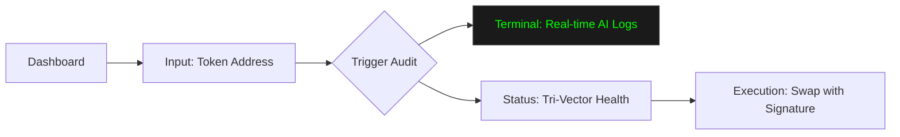

# 🖥️ Aegis Mission Control (Frontend)

The "Mission Control" dashboard is a Next.js-powered command center for the Aegis Protocol. It provides a real-time visualization of the AI's auditing process and a direct interface for protocol management.

## 🎨 UI Interaction Flow



## 🚀 Features

### 1. The Tri-Vector Health Gauge
Real-time indicators for the three core security pillars:
- **Market Health**: Pulls data from CoinGecko.
- **Contract Security**: Displays GoPlus intelligence.
- **AI Verdict**: Streams reasoning and risk flags from the OpenAI-powered DON.

### 2. "Hollywood" Terminal
A specialized log viewer that color-codes output from the Chainlink Runtime Environment (CRE). 
- **Yellow**: AI reasoning and semantics.
- **Green**: Approved signals and signatures.
- **Red**: Risk detections and rejection logic.

### 3. Protocol Management
- **Manual Triggers**: Directly execute simulations or test suites for different trade scenarios.
- **Anvil Integration**: Visual feedback for local blockchain transactions and signature verification.

## 🛠️ Tech Stack
- **Framework**: Next.js 14+ (App Router)
- **Styling**: Tailwind CSS + ShadcnUI
- **Icons**: Lucide React
- **Animations**: Framer Motion

## ⚡ Getting Started
1. Install dependencies:
   ```bash
   npm install
   ```
2. Start the development server:
   ```bash
   npm run dev
   ```
3. Open [http://localhost:3000](http://localhost:3000) in your browser.
