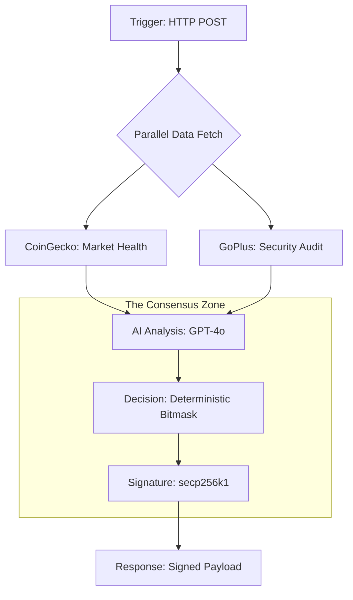

# 🧠 Aegis Workflow (The Technical Core)

This directory contains the **Chainlink Runtime Environment (CRE)** orchestration logic. It acts as the "Orchestrator" that bridges real-world security data, AI forensics, and on-chain execution.

## 🛠️ Architecture: The "Split-Brain" Logic

To ensure non-deterministic LLMs can reach consensus, Aegis uses a multi-stage pipeline:



## 🔑 Core Logic Implementation

### 1. Deterministic "Lock-In"
We achieve consensus on AI outputs using three primary levers:
- **Temperature 0**: Eliminates randomness in token selection.
- **Seed 42**: Ensures consistent sampling.
- **Bitmask Normalization**: The LLM output is parsed into a **Bitmask (uint256)**. Nodes don't compare the *essay* written by the AI, they compare the *integer flags*.

### 2. The Risk Bitmask Protocol
Risks are represented as binary flags. This allows gas-efficient evaluation on-chain:

| Bit | Value | Flag | logic |
| :--- | :--- | :--- | :--- |
| 0 | 1 | `LOW_LIQUIDITY` | Liq < $50k |
| 1 | 2 | `VOLATILITY` | 24h Change > 10% |
| 4 | 16 | `HONEYPOT` | GoPlus Blacklist |
| 6 | 64 | `WASH_TRADING` | Vol > 5x Liq |
| 9 | 512 | `AI_ANOMALY` | LLM Confidence < 0.7 |

### 3. Fail-Closed Resilience
If any external API (CoinGecko, GoPlus) fails, the workflow injects a `SUSPICIOUS` flag and defaults to `REJECT`. We never approve a trade if we are blind to the data.

## 💡 Developer Guide: WASM Constraints
This workflow runs in a **WASM (Javy)** environment.
> [!IMPORTANT]
> - **No Node Natives**: Use `Uint8Array` instead of `Buffer`.
> - **Custom Crypto**: See `utils.ts` for pure JS `sha1` and `keccak256`.
> - **Base64 Everything**: In/Out payloads must be Base64 encoded.

## 🧪 Simulation
Verify the logic flow locally:
```bash
bun run ../tests/simulate-consensus.ts
```
