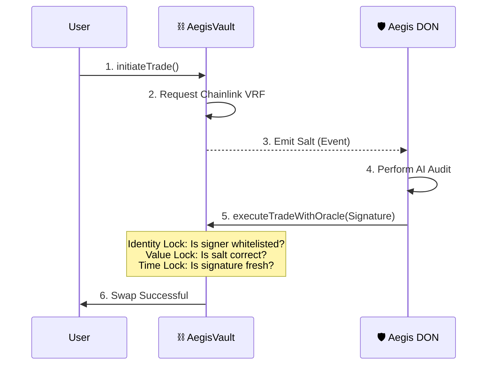

# ⛓️ Aegis Vault (On-Chain Enforcement)

> **"The Final Guardian."**

The `AegisVault.sol` contract is the on-chain enforcement layer of the protocol. It ensures that no transaction can be executed without a cryptographically valid signature from the Aegis Decentralized Oracle Network (DON).

## 🔒 Security Flow: The "Triple Lock"

Aegis uses three distinct cryptographic locks to prevent manipulation:



## 🛡️ Core Security Mechanics

### 1. Replay Protection (The VRF Salt)
Every verdict includes a unique 32-byte salt generated by **Chainlink VRF**. 
- Once a salt is used, it is marked as `processedSalts[salt] = true`.
- This ensures an attacker cannot take a "Safe" signature from yesterday and use it to approve a "Scam" trade today.

### 2. The "Triple Lock" Verification
Before executing any swap, the vault verifies:
- **Identity Lock**: The signature must originate from the whitelisted `oracle` address (the DON).
- **Value Lock**: The `riskHash` must include the specific `token`, `amount`, and `salt` requested.
- **Time Lock**: Signatures expire after 5 minutes (via `timestamp`) to prevent stale market data from being used.

### 3. Risk Thresholding
Even with a valid signature, the contract enforces a hard-coded safety limit:
- **`riskScore >= 7`**: The transaction is automatically blocked on-chain.
- **`verdict == false`**: The transaction reverts.

## 📜 Key Functions

### `executeTradeWithOracle(...)`
The primary entry point for trade execution. It takes the DON's signature and the audit parameters, performs the "Triple Lock" check, and executes the transfer.

### `updateOracle(address)`
Allows the contract owner to rotate the authorized DON public key in case of a node migration or key rotation.

## 🧪 Testing
The contract is verified using **Foundry/Anvil**.
```powershell
.\tests\test-contract.ps1
```
