# 🔄 Aegis Protocol: System Flows & State Machines

> **"The Map of the Machine."**
> This document provides a "painstakingly" detailed visual breakdown of every process within the Aegis ecosystem, from user intent to on-chain settlement.

---

## 1. The Grand Unified Flow (End-to-End Sequence)

This sequence diagram captures the entire lifecycle of a single interaction, spanning the User, Agent, Blockchain, Oracle Network, and External APIs.

```mermaid
sequenceDiagram
    autonumber
    
    participant User as 👤 User
    participant Dispatcher as 🤖 Dispatcher (ElizaOS)
    participant Wallet as 💼 Extension (MetaMask)
    participant Vault as 🏛️ AegisVault.sol
    participant Router as 🔗 FunctionsRouter
    participant DON as 🧠 Chainlink DON
    participant APIs as 📡 External APIs
    participant DEX as 🦄 Uniswap V3

    Note over User, Dispatcher: PHASE 1: INTENT & CONSTRUCTION
    User->>Dispatcher: "Swap 1 ETH for PEPE"
    Dispatcher->>Dispatcher: Parse Intent (LLM)
    Dispatcher->>Dispatcher: Construct Calldata (swap())
    Dispatcher-->>User: Request Signature
    
    User->>Wallet: Review Transaction
    Wallet->>Vault: 1. swap(token=PEPE, amount=1 ETH)
    
    Note over Vault: 🔒 STATE: LOCKED
    Vault->>Vault: Escrow Funds (msg.value)
    Vault->>Router: 2. sendRequest(source, args)
    
    Note over Router, DON: PHASE 2: FORENSIC AUDIT
    Router->>DON: Dispatch Job (JavaScript)
    
    rect rgb(20, 20, 30)
        Note right of DON: ⚡ THE TRIPLE-VECTOR SCAN
        DON->>APIs: Fetch CoinGecko (Market Data)
        DON->>APIs: Fetch GoPlus (Security Data)
        DON->>APIs: Fetch OpenAI (Semantic Data)
        APIs-->>DON: JSON Responses
        DON->>DON: Aggregate & Calculate Bitmask
    end
    
    DON->>Router: 3. fulfillRequest(riskBitmask, signature)
    
    Note over Vault, DEX: PHASE 3: ENFORCEMENT
    Router->>Vault: Callback (riskBitmask)
    
    alt Risk == 0 (SAFE)
        Vault->>DEX: 4a. Execute Swap
        DEX-->>Vault: Tokens Received
        Vault->>User: Transfer Tokens
        Note right of User: ✅ TRADE SETTLED
    else Risk > 0 (UNSAFE)
        Vault->>User: 4b. REFUND ETH
        Note right of User: 🚫 TRADE BLOCKED
    end
```



---

## 2. The Smart Contract Brain (State Machine)

The `AegisVault.sol` contract operates as a finite state machine for each request.


---

## 3. The Oracle Logic (Risk Bitmask Calculation)

How the TypeScript code in `workflow.ts` transforms raw API data into a deterministic `uint256`.

```mermaid
flowchart TD
    Start([🚀 Start Execution]) --> Inputs{Parse Args}
    Inputs -->|Token Address| P1
    Inputs -->|Chain ID| P2
    
    subgraph "Parallel Execution (Promise.all)"
        P1[Task 1: Market Scan] -->|CoinGecko API| M1{Check Liquidity}
        M1 -->|Liq < $50k| B1[Bit 0: LowLiquidity]
        M1 -->|Liq > $50k| OK1[Bit 0: OK]

        P2[Task 2: Security Scan] -->|GoPlus API| M2{Check Honeypot}
        M2 -->|IsHoneypot = true| B4[Bit 4: Scam]
        M2 -->|OwnerRenounced = false| B3[Bit 3: Governance]

        P3[Task 3: Semantic Scan] -->|OpenAI GPT-4o| M3{Analyze Metadata}
        M3 -->|"Impersonation Alert"| B5[Bit 5: Identity]
    end

    B1 & B4 & B3 & B5 --> Aggregator[📝 Bitwise OR Operation]
    OK1 --> Aggregator

    Aggregator --> Result{Total Risk > 0?}
    Result -->|Yes| Output[Return RiskCode + Reason]
    Result -->|No| Output[Return 0 (SAFE)]

    Output --> Encode[ABI Encode (uint256)]
    Encode --> End([🏁 Return to Chain])
    
    style B1 fill:#ef4444,color:white
    style B4 fill:#ef4444,color:white
    style B3 fill:#f59e0b,color:black
    style B5 fill:#ef4444,color:white
    style OK1 fill:#10b981,color:white
```

---

## 4. The Frontend UX (Visual State Machine)

The `App.tsx` component manages the user experience states, synchronizing animations with the "Dispatcher" and "Vault".


---

## 5. The Infrastructure (Component Architecture)

How the system is containerized and networked for the "Hollywood Demo".


---

> This documentation is a living artifact of the Aegis Protocol system architecture.
