# 🤖 Aegis AI Agent (ElizaOS)

The Aegis AI Agent, built on **ElizaOS**, acts as the primary user interface and "Intent Orchestrator." It translates natural language requests into verifiable on-chain actions by coordinating with the Chainlink DON.

## 🧠 Agent Interaction Flow

```mermaid
graph TD
    User([User]) -->|Natural Language| Agent[Aegis Agent]
    Agent -->|1. Intent Parsing| Plugin[aegisPlugin.ts]
    Plugin -->|2. Risk Audit| CRE[🛡️ Chainlink CRE]
    CRE -->|3. Signed Verdict| Plugin
    Plugin -->|4. Execution| Vault[⛓️ AegisVault.sol]
    Vault -->|5. Proof| User
    
    style CRE fill:#375bd2,color:#fff
    style Vault fill:#f1c40f,color:#000
```



## 🛠️ The Aegis Plugin (`src/aegisPlugin.ts`)

The core of the agent's logic resides in the custom `aegisPlugin`. This plugin bridges the gap between AI conversation and cryptographic enforcement.

### 1. Intent Detection
The agent uses specialized evaluators to detect when a user wants to:
- **Swap Tokens**: "Exchange 1 ETH for LINK"
- **Check Risk**: "Is this token safe to buy?"
- **Manage Vault**: "Show me my protected positions"

### 2. Guardrails (Pre-Flight)
Before any transaction is proposed, the plugin triggers the **Chainlink CRE Workflow**. 
- If the AI Oracle returns `REJECT`, the agent refuses to proceed and provides the reasoning directly to the user.
- If the Oracle returns `EXECUTE`, the agent prepares the transaction with the cryptographic signature attached.

## 🚀 Setup & Launch

1. **Install Dependencies**:
   ```bash
   npm install
   ```
2. **Environment**:
   Ensure your `.env` file in the root directory contains the `OPENAI_API_KEY`.
3. **Start the Agent**:
   ```bash
   # From the eliza/ directory
   npm run start --character="characters/aegis.character.json"
   ```

## 💡 Developer Notes
The `aegisPlugin` is designed to be chain-agnostic. While it currently interacts with the `AegisVault.sol` on Base/Anvil, the underlying audit logic via Chainlink CRE can be used for any EVM-compatible chain.
