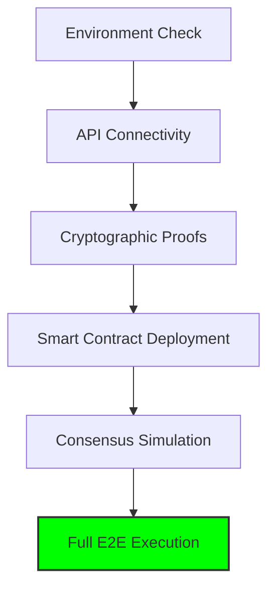

# 🧪 Aegis Verification Suite

This directory contains the comprehensive audit and simulation suite for the Aegis Risk Oracle. We prioritize **Reproducible Security** and **Deterministic Verification**.

## 🗺️ Verification Roadmap

## 🚀 The "Uber Tester"

### [`test-everything.ps1`](test-everything.ps1)
**The Single Source of Truth.** This script automates the entire 5-phase verification process for judges and developers.
- **Fail-Fast Logic**: If any critical component (Docker, API Keys, Signing Keys) is missing, the script exits immediately with a red alert.
- **Consensus Validation**: It triggers the 3-node simulation to ensure nodes agree before any contract tests run.

---

## 📜 High-Impact Simulations

### [`run-full-flow.ps1`](run-full-flow.ps1)
**The "Holy Grail" Demo.**
1. **Audit**: Initiates a real AI risk scan.
2. **Sign**: Produces a DON signature.
3. **Guard**: Submits to `AegisVault.sol`.
4. **Block**: Attempts a second submission with the same salt to prove **Replay Protection**.

### [`test-aegis.ps1`](test-aegis.ps1)
**The "Hollywood" Scenarios.** Visualizes complex trade decisions:
- `Pass`: Verified WETH (Safe).
- `Honeypot`: GoPlus-detected scam (Reject).
- `Economic`: Price manipulation (Reject).
- `Combo`: Compound risks (Reject).

---

## 🧩 Component Breakdown

| Script | Purpose |
| :--- | :--- |
| `test-all-apis.ts` | Validates CoinGecko, GoPlus, and OpenAI availability. |
| `test-contract.ps1` | Pure Solidity unit tests via Foundry. |
| `test-signature.ps1` | `secp256k1` recovery and EIP-191 compatibility tests. |

## 📂 Payloads (`payloads/`)
Raw JSON triggers used to test edge cases in the CRE runtime, ensuring the Zod schema and AI prompt are resilient.
